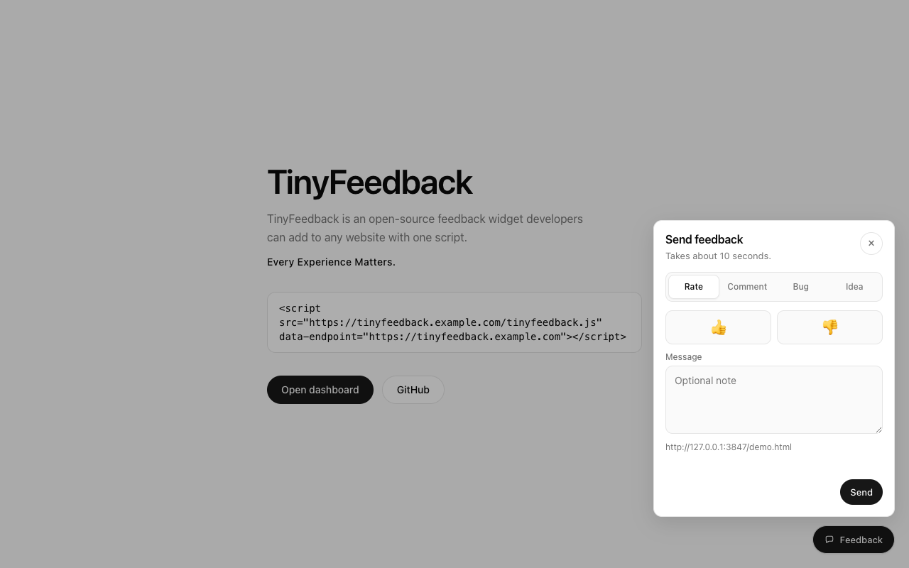
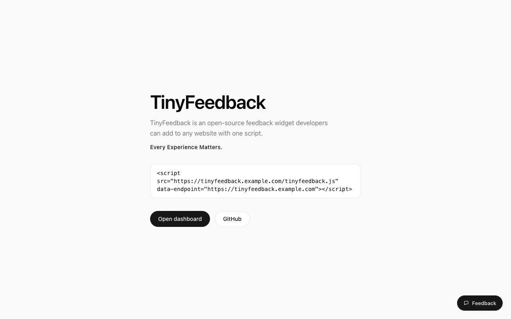
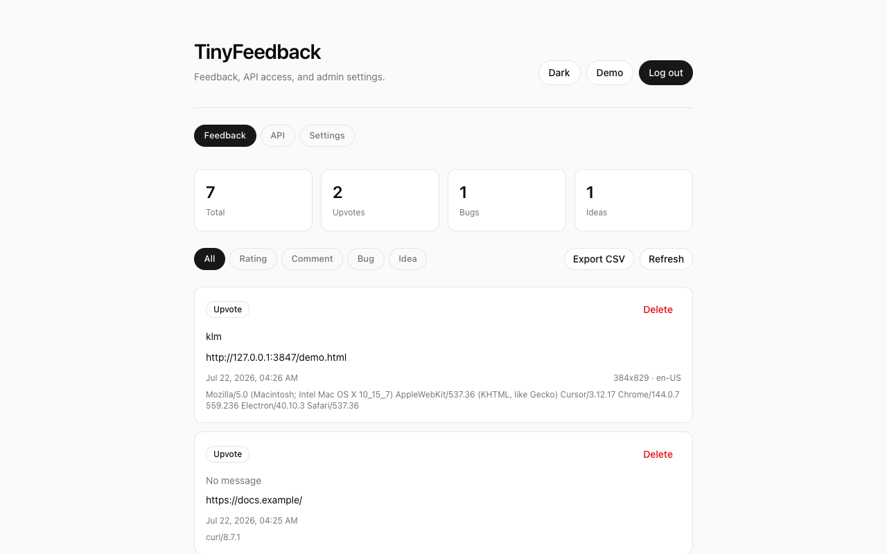

# TinyFeedback

**Every Experience Matters.**

TinyFeedback is an open-source feedback widget developers can add to any website with one script.

```html
<script
  src="https://tinyfeedback.example.com/tinyfeedback.js"
  data-endpoint="https://tinyfeedback.example.com"
></script>
```

<p align="center">
  
</p>

Visitors can rate a page, leave a comment, report a bug, or suggest an idea. Each submission includes the page URL and basic browser info. You get a password-protected dashboard, API tokens, domain allowlisting, dark mode, and CSV export.

No React. No frameworks. Vanilla HTML, CSS, and JS — Tailwind only at build time for CSS. **Zero runtime npm dependencies.**

Current release: **v1.1.0** — see [CHANGELOG.md](CHANGELOG.md).

<p align="center">
  
  &nbsp;
  
</p>

## Features

- One-script embed (Shadow DOM widget)
- Dashboard: feedback inbox, API docs/tokens, settings
- Public URL setting (so snippets use `tinyfeedback.example.com`, not `127.0.0.1`)
- Allowed domains for sites that embed the widget (+ optional auto-add)
- Spam protection: per-IP rate limits + honeypot field
- Bearer API tokens for list / delete / export
- JSON file storage under `data/` (gitignored)

## Quick start (local)

```bash
git clone git@github.com:sambassari/TinyFeedback.git
cd TinyFeedback
cp .env.example .env
# set ADMIN_PASSWORD and SESSION_SECRET
npm install
npm start
```

Open:

- Demo: http://127.0.0.1:3847/demo.html  
- Login → dashboard: http://127.0.0.1:3847/login.html  

On localhost without `.env`, the default password is `admin` (demos only). Needs Node.js 18+.

---

## Deploy

Pick **Docker** or **Node without Docker**. In both cases put HTTPS in front (Caddy or Nginx), set a strong password + session secret, and set `PUBLIC_URL` to your public hostname.

### Option A — Docker Compose

```bash
cp .env.example .env
# Required:
#   ADMIN_PASSWORD=...
#   SESSION_SECRET=...   # 16+ chars
#   PUBLIC_URL=https://tinyfeedback.example.com

docker compose up -d --build
```

- App listens on port `3847` (mapped from the container)
- Data persists in the `tinyfeedback-data` volume
- Put Caddy/Nginx (or a cloud load balancer) in front for TLS

Health check: `GET /api/health`

```bash
docker compose logs -f
docker compose down
```

### Option B — Node without Docker

```bash
git clone git@github.com:sambassari/TinyFeedback.git /opt/tinyfeedback
cd /opt/tinyfeedback
cp .env.example .env
# edit .env — keep HOST=127.0.0.1, set PUBLIC_URL to your HTTPS domain
npm install
npm run build:css
npm start
```

Keep the app on localhost and terminate TLS on a reverse proxy.

**Caddy** (auto HTTPS) — see [`deploy/Caddyfile`](deploy/Caddyfile):

```bash
# edit the hostname in deploy/Caddyfile, then:
caddy run --config deploy/Caddyfile
```

**Nginx** — see [`deploy/nginx.conf`](deploy/nginx.conf). Point `server_name` at your domain, enable TLS (e.g. Certbot), proxy to `127.0.0.1:3847`. Forward `Host`, `X-Forwarded-For`, and `X-Forwarded-Proto` so secure cookies work.

**systemd** — see [`deploy/tinyfeedback.service`](deploy/tinyfeedback.service) to run the Node process as a service, then put Caddy/Nginx in front.

### After deploy

1. Open `https://tinyfeedback.example.com/login.html`
2. Settings → confirm **Public URL**
3. Settings → manage **Allowed domains** (turn off auto-add for a strict allowlist)
4. Copy the **Install** snippet onto your sites
5. API tab → create a Bearer token if you need scripts/CI

---

## Embed

Use the **full URL** of your TinyFeedback host (not a relative path on the customer site). Dashboard **Settings → Install** fills this in from **Public URL**.

| Attribute | Default | Description |
| --- | --- | --- |
| `data-endpoint` | script origin | API base URL |
| `data-position` | `right` | `left` or `right` |
| `data-label` | `Feedback` | Button text |
| `data-title` | `Send feedback` | Panel title |
| `data-theme` | `auto` | `auto`, `light`, or `dark` |
| `data-manual` | — | Skip auto-init; call `TinyFeedback.init()` |

```html
<script
  src="https://tinyfeedback.example.com/tinyfeedback.js"
  data-endpoint="https://tinyfeedback.example.com"
  data-position="right"
  data-theme="auto"
></script>
```

Manual init:

```html
<script src="https://tinyfeedback.example.com/tinyfeedback.js" data-manual></script>
<script>
  TinyFeedback.init({
    endpoint: "https://tinyfeedback.example.com",
    position: "left",
  });
</script>
```

**Public URL** = where TinyFeedback itself is hosted.  
**Allowed domains** = customer sites allowed to POST feedback.

---

## Auth & spam protection

| Surface | Access |
| --- | --- |
| `POST /api/feedback` | Public (domain allowlist + rate limit + honeypot) |
| Dashboard / password / tokens / domains | Session cookie |
| List / delete / export | Session **or** `Authorization: Bearer tf_live_…` |

| Variable | Description |
| --- | --- |
| `ADMIN_PASSWORD` | Bootstraps admin hash on first run |
| `SESSION_SECRET` | Cookie signing secret (16+ characters) |
| `FEEDBACK_RATE_MAX` | Max public POSTs per IP per window (default `30`) |
| `FEEDBACK_RATE_WINDOW_MS` | Window length in ms (default `900000` = 15 min) |

Login is also rate-limited. Prefer HTTPS so the session cookie is marked `Secure`. Details: [SECURITY.md](SECURITY.md).

---

## API

| Method | Path | Auth | Description |
| --- | --- | --- | --- |
| `GET` | `/api/health` | No | Health check (`version`) |
| `GET` | `/api/config` | No | `{ publicUrl, version }` |
| `GET`/`POST` | `/api/settings` | Session | Public URL |
| `POST` | `/api/auth/login` | No | Session cookie |
| `POST` | `/api/auth/logout` | No | Clear session |
| `GET` | `/api/auth/me` | Session | Session check |
| `POST` | `/api/auth/password` | Session | Change password |
| `GET`/`POST` | `/api/domains` | Session | Allowed domains / auto-add |
| `DELETE` | `/api/domains/:domain` | Session | Remove domain |
| `GET`/`POST` | `/api/tokens` | Session | List / create API tokens |
| `DELETE` | `/api/tokens/:id` | Session | Revoke token |
| `POST` | `/api/feedback` | No | Create feedback |
| `GET` | `/api/feedback` | Session or Bearer | List (`?type=bug`) |
| `DELETE` | `/api/feedback/:id` | Session or Bearer | Delete |
| `GET` | `/api/export.csv` | Session or Bearer | CSV export |

Create feedback body:

```json
{
  "type": "bug",
  "message": "Checkout button does nothing on mobile",
  "pageUrl": "https://example.com/checkout",
  "userAgent": "…",
  "language": "en-US",
  "viewport": "390x844"
}
```

`type` is `rating`, `comment`, `bug`, or `feature`. For ratings also send `"rating": "up"` or `"down"`.

---

## Storage

All under `data/` (gitignored, Docker volume recommended):

| File | Purpose |
| --- | --- |
| `feedback.json` | Submissions |
| `admin.json` | Password hash |
| `tokens.json` | API token hashes |
| `domains.json` | Allowed origins |
| `settings.json` | Public URL |

---

## Develop

```bash
npm run dev:css    # watch Tailwind
npm run build:css  # build public/styles.css
npm start          # build CSS, then serve
npm run dev        # build CSS, then serve with --watch
```

| Variable | Default | Description |
| --- | --- | --- |
| `PORT` | `3847` | Listen port |
| `HOST` | `127.0.0.1` | Bind address (`0.0.0.0` in Docker / LAN) |
| `PUBLIC_URL` | — | e.g. `https://tinyfeedback.example.com` |
| `ADMIN_PASSWORD` | `admin` on localhost only | First-run password |
| `SESSION_SECRET` | insecure local default | Cookie signing |

Public binds (`HOST` not localhost) require `ADMIN_PASSWORD` and `SESSION_SECRET` or the process exits.

## Project layout

```
TinyFeedback/
├── server.js
├── lib/                    # auth, domains, settings, rate limit
├── public/                 # widget, dashboard, demo, built CSS
├── src/styles.css          # Tailwind source
├── deploy/                 # Caddy, Nginx, systemd (no Docker)
├── docs/screenshots/       # README images
├── Dockerfile
├── docker-compose.yml
├── data/                   # runtime JSON (volume / gitignored)
├── .env.example
└── README.md
```

## Versioning

SemVer in `package.json` (source of truth). The server reads it for `/api/health` and `/api/config`; the widget banner matches the same number. Release notes live in [CHANGELOG.md](CHANGELOG.md).

```bash
# bump when releasing
# 1. edit package.json version + CHANGELOG.md + public/tinyfeedback.js banner
# 2. commit, tag, push
git tag v1.1.0
git push origin v1.1.0
```

## Contributing

Issues and pull requests welcome. Keep changes small and focused. See [CONTRIBUTING.md](CONTRIBUTING.md).

## License

[MIT](LICENSE) © Sam Bassari
